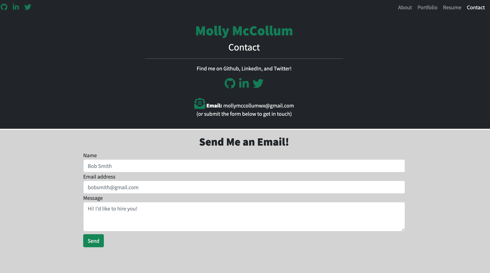

# Portfolio 
This is a Front-End Developer portfolio featuring a simple design using bootstrap. On the webpage, you can find an about section, portfolio of recent work, a PDF resume, and contact page. 
   

## Installation

---
The code for this webpage can be found at [Github](https://github.com/mollymccollumwx/updated-portfolio). The [deployed website](https://mollymccollumwx.github.io/updated-portfolio/) is features a responsive design. 

## Usage

---
When the webpage is first opened, the user is greeted by an "About Me" introduction:

The user will be able to toggle between pages using the navigation bar in the top right corner of the screen. On the contact page, the user will find a contact form to fill out:

Finally, to find examples of work and projects complete, the user can access the Portfolio page through the navigation bar:

## Credits

---
This webpage was created during the Georgia Tech Coding Bootcamp. Thanks to the TA's and classmates that gave advice on approaching and fixing problems in the code. 

## License 

---
MIT License

Copyright (c) [2020] [Molly McCollum]

Permission is hereby granted, free of charge, to any person obtaining a copy
of this software and associated documentation files (the "Software"), to deal
in the Software without restriction, including without limitation the rights
to use, copy, modify, merge, publish, distribute, sublicense, and/or sell
copies of the Software, and to permit persons to whom the Software is
furnished to do so, subject to the following conditions:

The above copyright notice and this permission notice shall be included in all
copies or substantial portions of the Software.

THE SOFTWARE IS PROVIDED "AS IS", WITHOUT WARRANTY OF ANY KIND, EXPRESS OR
IMPLIED, INCLUDING BUT NOT LIMITED TO THE WARRANTIES OF MERCHANTABILITY,
FITNESS FOR A PARTICULAR PURPOSE AND NONINFRINGEMENT. IN NO EVENT SHALL THE
AUTHORS OR COPYRIGHT HOLDERS BE LIABLE FOR ANY CLAIM, DAMAGES OR OTHER
LIABILITY, WHETHER IN AN ACTION OF CONTRACT, TORT OR OTHERWISE, ARISING FROM,
OUT OF OR IN CONNECTION WITH THE SOFTWARE OR THE USE OR OTHER DEALINGS IN THE
SOFTWARE.